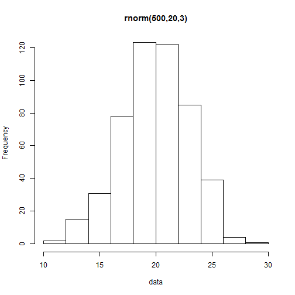

Shiny App: Normal and Uniform Distributions
========================================================
author: Inigo Leon
date: Mon Dec 22 01:09:35 2014
transition: rotate

Description
========================================================

This presentation is an example of the shiny app "Distributions". It is a demostration of the Normal and Uniform distributions.

- rnorm()
- runif()


Demonstration
========================================================
How does it work the shiny app?

- Enter the amount of observations you want to simjulate in the input box provided (minimum value = 1, and maximum value = 10000)
- Select one distribution: Normal or Uniform
- If Normal is selected, you should enter both mean and standard deviation values
- If Uniform is selected, you should enter a range with min and max values
- Press the apply changes button for updating the plot and data

The right side panel has two tabs: one for the hist() plot and summary and the other one for the generated data.

Demonstration 2
========================================================
Let's suppose we selected the Normal distribution with mean = 20 and sd = 3 and number of observations = 500,
then

```r
data = rnorm(500,20,3)
summary(data)
```

```
   Min. 1st Qu.  Median    Mean 3rd Qu.    Max. 
   10.7    18.0    20.0    20.0    22.1    28.3 
```

Demonstration 3
========================================================
Plotting the data:


```r
hist(data, main = "rnorm(500,20,3)")
```

 
